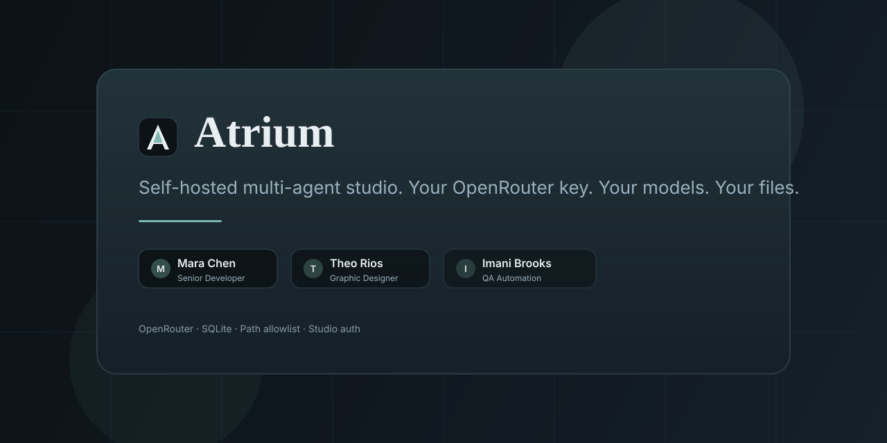
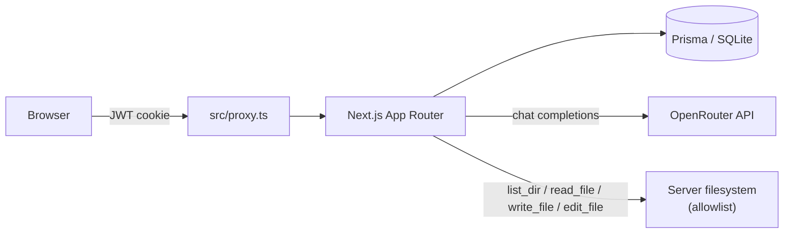

# Atrium

**Self-hosted multi-agent studio. Your OpenRouter key. Your models. Your files.**

<p align="center">
  <a href="LICENSE"></a>
  <a href="https://nextjs.org/"></a>
  <a href="https://www.typescriptlang.org/"></a>
  <a href="CONTRIBUTING.md"></a>
</p>

<p align="center">
  
</p>

Atrium is a calm, self-hosted multi-agent chat studio by [Kyaw Zaw Hein](https://github.com/kyawzawhein-qa). Define specialist agents, pick an OpenRouter model per agent, and optionally grant absolute filesystem paths so agents can list, read, write, and edit files — all on your machine, with a local SQLite database.

## Why Atrium

- **Your key, your models** — Paste an OpenRouter API key in Settings. Each agent chooses its own model. The key never lives in `.env` or git.
- **Agents you own** — Name, description (system prompt), and model are first-class. Seeded demos are ordinary, deletable rows.
- **Bounded computer access** — An explicit path allowlist gates `list_dir`, `read_file`, `write_file`, and `edit_file` on the server. Empty allowlist means tools are not granted.

## Features

- **Custom agents** with per-agent OpenRouter models
- **Path allowlist** for absolute paths (`list_dir`, `read_file`, `write_file`, `edit_file`)
- **Local SQLite** via Prisma (settings, agents, threads, messages)
- **Studio auth** — password gate with a signed JWT cookie (`ATRIUM_PASSWORD`)

## Quick start

```bash
npm install
cp .env.example .env
npm run db:setup
npm run dev
```

Open [http://localhost:3000](http://localhost:3000) and sign in.

| Variable | Local default |
| --- | --- |
| `ATRIUM_PASSWORD` | `atrium` |

Set `ATRIUM_SESSION_SECRET` for anything beyond a local demo.

> **Do not put your OpenRouter API key in `.env`.** Paste it in the app at **Settings**. It is stored in the SQLite Settings row and shown masked after save.

### First session

1. Sign in with the studio password.
2. Open **Settings** → paste your OpenRouter key → save.
3. Create an agent (or edit a seeded one): name, description, model.
4. Start a chat. Completions use that agent’s `modelId` via `https://openrouter.ai/api/v1`.
5. Optionally grant absolute folders under the path allowlist.

## Security notes

- **Allowlist** — Tools run on the machine hosting Atrium. Only absolute paths are accepted. Traversal outside granted roots is rejected. An empty allowlist returns “not granted.”
- **Key storage** — The OpenRouter key lives in SQLite, not environment files. Never commit `.env`, `*.db`, or keys.
- **Auth** — Change `ATRIUM_PASSWORD` and `ATRIUM_SESSION_SECRET` for shared or production hosts. See [SECURITY.md](SECURITY.md).

## Architecture



More detail: [docs/ARCHITECTURE.md](docs/ARCHITECTURE.md).

## Roadmap

Honest and not yet implemented:

- Telegram + web chat surfaces
- GitHub repository tools

## Contributing

See [CONTRIBUTING.md](CONTRIBUTING.md) and the [Code of Conduct](CODE_OF_CONDUCT.md). Bug reports and thoughtful PRs are welcome.

## License

[MIT](LICENSE) © 2026 [Kyaw Zaw Hein](https://github.com/kyawzawhein-qa)

**Repository:** [github.com/kyawzawhein-qa/atrium](https://github.com/kyawzawhein-qa/atrium)
