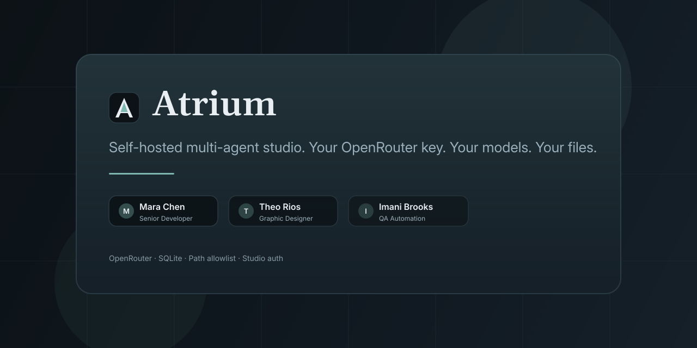
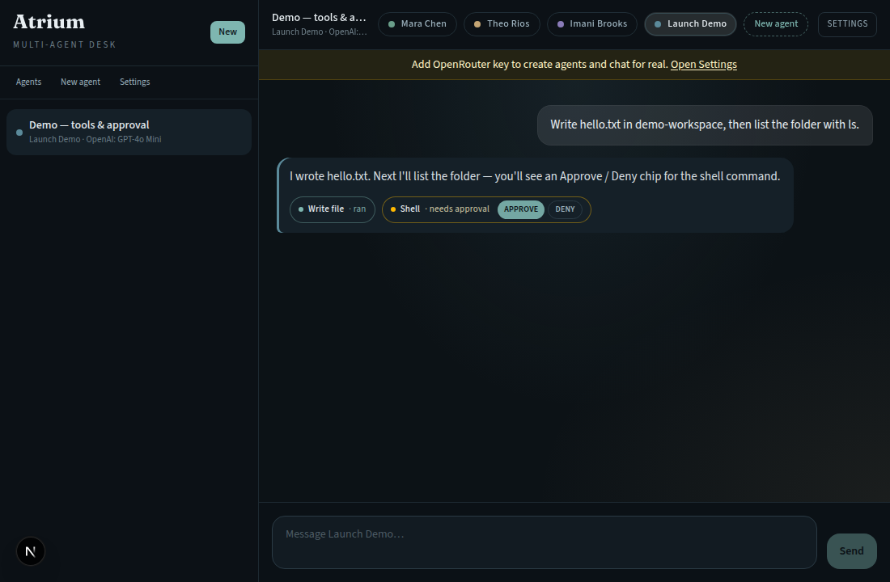
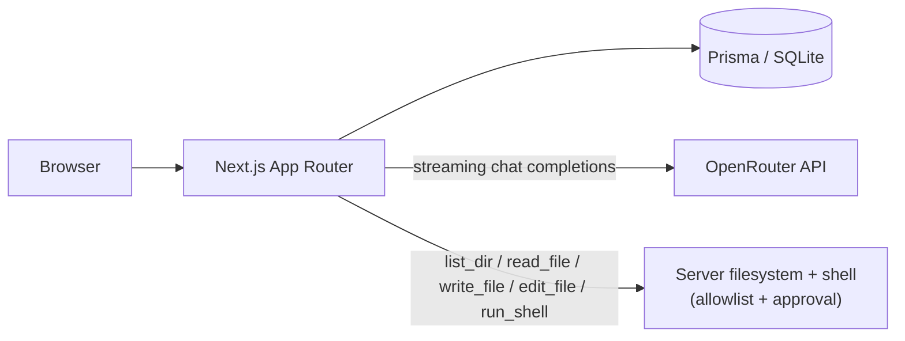

# Atrium

**Self-hosted multi-agent studio. Your OpenRouter key. Your models. Your files.**

<p align="center">
  <a href="LICENSE"></a>
  <a href="https://nextjs.org/"></a>
  <a href="https://www.typescriptlang.org/"></a>
  <a href="CONTRIBUTING.md"></a>
</p>

<p align="center">
  
</p>

Atrium is a calm, self-hosted multi-agent chat studio by [Kyaw Zaw Hein](https://github.com/kyawzawhein-qa). Define specialist agents, pick an OpenRouter model per agent, and optionally grant absolute filesystem paths (and shell) so agents can list, read, write, edit, and run allowlisted commands — all on your machine, with a local SQLite database. **Local-first: no login.**

## Why Atrium

- **Your key, your models** — Paste an OpenRouter API key in Settings. Each agent chooses its own model. The key never lives in `.env` or git.
- **Agents you own** — Name, description (system prompt), and model are first-class. Seeded demos are ordinary, deletable rows.
- **Bounded computer access** — An explicit path allowlist gates `list_dir`, `read_file`, `write_file`, `edit_file`, and optional `run_shell` on the server. Empty allowlist means tools are not granted.
- **No login** — Open the studio and chat. Streaming replies via SSE; every shell command asks for Approve / Deny.

## Features

<p align="center">
  
</p>

- **Custom agents** with per-agent OpenRouter models
- **Streaming chat** (SSE: tokens + tool chips as they arrive)
- **Path allowlist** for absolute paths (`list_dir`, `read_file`, `write_file`, `edit_file`)
- **Optional shell** — Settings toggle “Allow shell in granted folders”; every command needs approval
- **Agent handoffs** — `message_agent` lets one specialist consult another (1-hop; visible handoff chip in chat)
- **Local SQLite** via Prisma (settings, agents, threads, messages)

## Quick start

### One command (recommended)

Requires [Node.js 20+](https://nodejs.org/). Creates a local `atrium` folder in the current directory, installs dependencies, copies `.env.example` to `.env` (no secrets), runs database setup, and starts the dev server on **localhost only**.

**macOS / Linux (bash, zsh, fish):**

```bash
npx -y github:kyawzawhein-qa/atrium create-atrium
```

**Windows (PowerShell):**

```powershell
npx -y github:kyawzawhein-qa/atrium create-atrium
```

Use a custom folder name:

```bash
npx -y github:kyawzawhein-qa/atrium create-atrium my-studio
```

Open [http://localhost:3000](http://localhost:3000) — redirects to `/chat`. No password.

> **Note:** The first `npx` run downloads the repo once so the bootstrap command is available. Your actual studio is created in the folder above with its own `node_modules` and SQLite database. For a lighter one-liner later, publish the `create-atrium` subpackage to npm (for example `create-atrium` or `@kyawzawhein/create-atrium`) so users can run `npm create atrium@latest` — that publish step is manual and not done from CI.

### Manual setup (from a clone)

```bash
git clone https://github.com/kyawzawhein-qa/atrium.git
cd atrium
npm install
cp .env.example .env          # Windows (PowerShell): Copy-Item .env.example .env
npm run db:setup
npm run dev
```

| Variable | Purpose |
| --- | --- |
| `DATABASE_URL` | SQLite URL (default `file:./dev.db`) |
| `ATRIUM_PUBLIC_URL` | Optional OpenRouter `HTTP-Referer` |

> **Do not put your OpenRouter API key in `.env`.** Paste it in the app at **Settings**. It is stored in the SQLite Settings row and shown masked after save.

### First session

1. Open **Settings** → paste your OpenRouter key → save.
2. Create an agent (or edit a seeded one): name, description, model.
3. Start a chat. Completions stream from that agent’s `modelId` via `https://openrouter.ai/api/v1`.
4. Optionally grant absolute folders under the path allowlist.
5. Optionally enable **Allow shell in granted folders** for `run_shell` (every command shows Approve / Deny).

### Inter-agent orchestration (dogfood)

With an OpenRouter key configured, open a chat with **Theo Rios** (graphic designer) and ask something like:

> Ask Mara to review the API shape for the hero section.

Theo should call `message_agent`, you will see an **Agent handoff** chip (`→ Mara Chen (senior-developer): …`) while Mara answers in her own persona, then Theo summarizes for you. Handoffs are **one hop only** — nested agents cannot chain further `message_agent` calls. Seeded personas are refreshed automatically on server start; run `npm run db:seed` manually if you want to force an upsert.

### 45-second demo

After pasting your OpenRouter key, click **Run 45s demo** on the chat home screen. It grants `demo-workspace/`, enables shell, and walks you through `write_file` and shell approval. Full script: [docs/DEMO.md](docs/DEMO.md).

## Plugins

Third-party extensions live in [`plugins/`](plugins/) — drop in a folder with `plugin.json` (+ optional `index.mjs`) and restart the server. Plugins are **trusted local code** (no remote install). Tool handlers are offered to agents only after the operator grants at least one allowlisted path. See [`plugins/README.md`](plugins/README.md) and the included `hello-world` example.

## Security notes

- **Allowlist** — Tools run on the machine hosting Atrium. Only absolute paths are accepted. Traversal outside granted roots is rejected. An empty allowlist returns “not granted.”
- **Shell** — Off by default. Dangerous patterns are hard-rejected. Every command waits for operator approval (5-minute TTL).
- **Operator session** — Approve / Deny for shell commands requires a same-origin browser session and an httpOnly operator cookie (issued automatically when you open the studio). Bind Atrium to **localhost** (the default dev server) or put authentication in front of a reverse proxy on shared machines — anyone who can open the UI is treated as the operator. See [SECURITY.md](SECURITY.md) for the full threat model.
- **Key storage** — The OpenRouter key lives in SQLite, not environment files. Never commit `.env`, `*.db`, or keys. See [SECURITY.md](SECURITY.md).

## Architecture



More detail: [docs/ARCHITECTURE.md](docs/ARCHITECTURE.md).

## Roadmap

Honest and not yet implemented:

- Telegram + web chat surfaces
- GitHub repository tools

## Contributing

See [CONTRIBUTING.md](CONTRIBUTING.md) and the [Code of Conduct](CODE_OF_CONDUCT.md). Bug reports and thoughtful PRs are welcome.

## License

[MIT](LICENSE) © 2026 [Kyaw Zaw Hein](https://github.com/kyawzawhein-qa)

**Repository:** [github.com/kyawzawhein-qa/atrium](https://github.com/kyawzawhein-qa/atrium)
